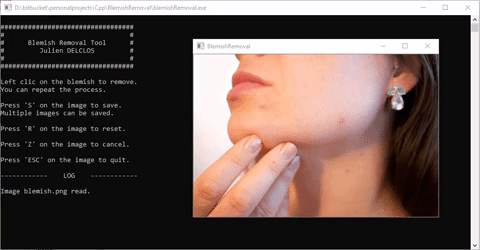
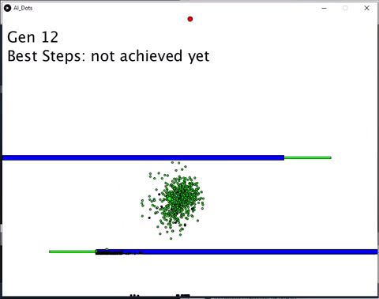
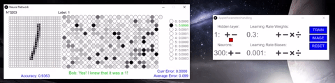

# Personal Projects: Julien DELCLOS

A repository containing personal projects, done on my **free-time**.

There will be, here, no description of professional works. 

---
# A - Python

[Folder](https://github.com/JujuDel/PersonnalProjects/Python/)

---
## A.1 - Object Detection and tracking

Detect and track a sport ball in a video. YoloV3 is used for detection and the trackerTLD for the tracking.

The interface allows to force the sport ball redection to have a better accuracy.

## A.2 - Facial Detection & Extraction & Aligment

Find one or more faces in an image and extract an image per face so that the eyes are in a particular position.

## A.3 - Facial Recognition

Use the previous face detection and recognize a person within a dataset.

To add a new face in the dataset, add the corresponding *.jpg* file in the *data/images/* folder.

---
# B - C++

[Folder](https://github.com/JujuDel/PersonnalProjects/Cpp/)

---
## B.1 - Blemish Removal

Removing Blemish by clicking on it, using computer vision techniques:

## B.2 - Chroma Keying

Removing green background by selecting it, using computer vision techniques:

---
# C - Processing

[Folder](https://github.com/JujuDel/PersonnalProjects/Processing/)

---
## C.1 - Genetic algotithm: Basic path finding

A basic path finding using an incremental genetic algorithm and reinforcement learning.

The goal is to reach the red circle with the fewest step possible. The obstacle are in blue and going threw the green sticks give to a dot a reward.

## C.2 - Genetic algotithm: Car race

A more sophisticated incremental genetic algorithm and reinforcement learning.

Going through the green checkpoints give a reward, driving backward and decelerating give a penalty.

Done in collaboration with *Grégory Largange*.

## C.3 - Basic Neural network: Digit recognition

Neural Network's *"Hello World"*: Digit recognition with the MNIST database.

Hyper-parameter tuning done by hand with the developed interface.

---
# D - Jupyter (Python notebook)

More details can be found in the *Notebook*'s [folder](https://github.com/JujuDel/PersonnalProjects/Notebooks/) (and its README).

You'll find here:

1. Logic Regression with a shallow Neural Network
2. 2D Data Classification using a shallow Neural Network with 1 hidden layer
3. Logic Regression with a Deep Neural Network
4. Gradient Checking algorithm
5. Regularization techniques
6. Data Augmentation
7. Optimization techniques
8. Detect fingers made numbers