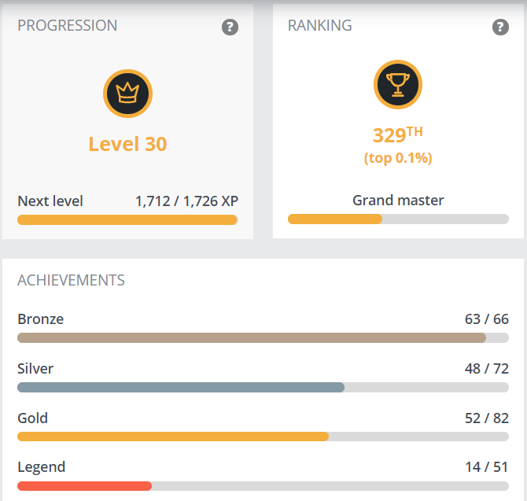

# Summed up repo

A repository containing only links to my other repo, associated with gif, images and small descriptions.

---
# A - Coding Challenge & Puzzle & Courses

##  [CodinGame](https://www.codingame.com/home)

[My repo](https://github.com/JujuDel/CodinGame)

[My CodinGame profile](https://www.codingame.com/profile/b944cb66159c494961db183c595578915353933)

### Ranking 15/10/2020:

<table>
  <tr>
    <td rowspan="6"></td>
    <td>Global</td>
    <td colspan="2">Top 0.3%</td>
    <td rowspan="6"></td>
  </tr>
  <tr>
    <td>Contests</td>
    <td>Top 2%</td>
    <td>457 / 35'968</td>
  </tr>
  <tr>
    <td>Bot programming</td>
    <td>Top 2%</td>
    <td>2'419 / 127'944</td>
  </tr>
  <tr>
    <td>Clash of Code</td>
    <td>Top 0.1%</td>
    <td>26 / 192'389</td>
  </tr>
  <tr>
    <td>Optimization</td>
    <td>Top 3%</td>
    <td>490 / 19'980</td>
  </tr>
  <tr>
    <td>Code golf</td>
    <td>Top 0.8%</td>
    <td>214 / 28'362</td>
  </tr>
</table>

Codingame's certification |
:---: |
 |

## Certifications

### OpenCV

22/05/2020 - [COMPUTER VISION II: APPLICATIONS (PYTHON)](https://courses.opencv.org/certificates/0220f408aa7b4f108fa6caeadd67b68f) - Earned grade 97%

17/01/2020 - [COMPUTER VISION I (PYTHON)](https://courses.opencv.org/certificates/5a617344365141218a30908e3d70c107) - Earned grade 99%

25/12/2019 - [COMPUTER VISION I (C++)](https://courses.opencv.org/certificates/8bfc73916051470db419b58473e7e326) - Earned grade 97%

### Coursera

13/06/2019 - [Covolutional Neural Networks](https://www.coursera.org/account/accomplishments/certificate/DBY2EGX7DJV7)

02/06/2019 - [Structuring Machine Learning Projects](https://www.coursera.org/account/accomplishments/certificate/NQQDK87X6BCS)

30/05/2019 - [Improving Deep Neural Networks: Hyperparameter tuning, Regularization and Optimization](https://www.coursera.org/account/accomplishments/certificate/HB476JH9JZ3U)

23/05/2019 - [Neural Networks and Deep Learning](https://www.coursera.org/account/accomplishments/certificate/97PU3C7NJSLQ)

---
# B. Late 2020 - [Mars Lander - Genetic Algorithm](https://github.com/JujuDel/MarLander_Genetic)

This project aims to resolve the series of CodinGame's problem called Mars Lander using a Genetic Algorithm.

It has been developed in C++ and using modern OpenGL for the visualization part.

---
# C. May 2020 - [Virtual MakeUp](https://github.com/JujuDel/VirtualMakeUp)

This tool uses a variety of computer vision techniques and libraries to automatically detect the iris, the lips and the teeth on the image to perform a virtual makeup:

Input | Mask | Output
:---: | :---: | :---:
 |  | 

---
# D. May 2020 - [DoppelGanger](https://github.com/JujuDel/DoppelGanger)

This project aims to find a doppelganger or look-alike to a given person within a celebrity dataset:
Input | Doppelganger
:---: | :---:
sofia-solares | Selena
 | 

---
# E. Late 2019 to Early 2020 - [FancyOpenCV](https://github.com/JujuDel/FancyOpenCV)

This repo contains small projects/app that uses OpenCV.

### Object Detection and Tracking

### Blemish Removal

### Chroma Keying

### Smile detection and bug eye

---
# F. Late 2019 - [FaceDetection-Recognition](https://github.com/JujuDel/FaceDetection-Recognition)

This tool uses dlib and OpenCV to detect faces, extract them align them and recognizes them.

### Facial Detection & Extraction & Aligment

### Facial Recognition

---
# G. Mid 2019 - [DeepLearningTheoryApplied](https://github.com/JujuDel/DeepLearningTheoryApplied)

Some of these projects were born after having followed the specialization in Deep Learning offered by [deeplearning.ia](https://www.deeplearning.ai/) on Coursera. The aim is to carry out my own projects, from scratch, by improving my knowledge, implementations and explanations and taking into account the new knowledge acquired.

You'll find here:
1. Logic Regression with a shallow Neural Network
2. 2D Data Classification using a shallow Neural Network with 1 hidden layer
3. Logic Regression with a Deep Neural Network
4. Gradient Checking algorithm
5. Regularization techniques
6. Data Augmentation
7. Optimization techniques
8. Detect fingers made numbers

---
# H. Early 2019 - Processing

A serie of 3 projects done in Processing:

### [0. AI_Dots](https://github.com/JujuDel/Processing_0-AI_Dots)
A basic path finding using an incremental genetic algorithm and reinforcement learning.

### [1. Car_Race](https://github.com/JujuDel/Processing_1-Car_Race)
A more sophisticated incremental genetic algorithm and reinforcement learning.

### [2. Basic_Neural_Network](https://github.com/JujuDel/Processing_2-Basic_Neural_Network)
Neural Network's _"Hello World"_: from scratch digit recognition with the MNIST database.

